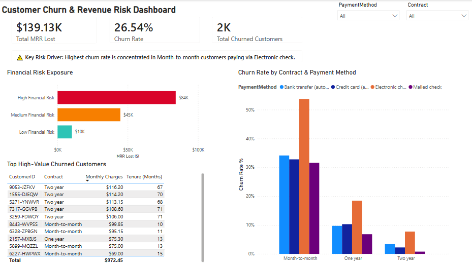

# 📊 Customer Churn & MRR Risk Analytics Dashboard

A data analytics project built using **Google BigQuery (SQL)** and **Power BI** to analyze customer churn, quantify Monthly Recurring Revenue (MRR) loss, and identify customer segments that contribute the most to revenue risk.

---

## Dashboard Preview



---

# Project Overview

Many churn dashboards focus only on the number of customers leaving. While that is useful, it doesn't always show the real business impact.

For example, losing one customer paying **$110/month** has a much greater financial impact than losing a customer paying **$20/month**.

The goal of this project was to analyze customer churn from a **revenue perspective** instead of only looking at customer counts. Using SQL and Power BI, I explored which customer groups contributed the most to lost revenue and what actions could potentially reduce churn.

---

# Key Business Findings

- **Total Lost Monthly Revenue:** **$139.13K**
- **Overall Churn Rate:** **26.54%**
- **Total Churned Customers:** **2,000**
- **60.4% of lost MRR** came from customers classified as **High Financial Risk**.
- Customers on **Month-to-Month contracts** paying through **Electronic Check** had churn rates above **50%**, making them the highest-risk segment.

---

# How I Built the Project

### 1. Data Preparation (Google BigQuery)

I first explored the raw customer data using SQL to understand overall churn behavior.

After exploring the dataset, I created several calculated fields to make reporting easier inside Power BI.

These included:

- `is_churned` flag
- `mrr_lost`
- Financial Risk classification (High / Medium / Low)

The risk categories were created using customer monthly charges and contract type so the dashboard could focus on revenue exposure instead of customer count alone.

---

### 2. Dashboard Development (Power BI)

After preparing the data, I connected the final dataset to Power BI and designed an interactive dashboard.

The dashboard includes:

- KPI cards for Lost MRR, Churn Rate and Churned Customers
- Contract Type analysis
- Payment Method analysis
- Financial Risk segmentation
- Customer detail table for follow-up analysis
- Interactive slicers for easier filtering

---

# Business Recommendations

Based on the analysis, I would recommend:

### 1. Focus on High-Value Month-to-Month Customers

Customers paying **$80 or more per month** on Month-to-Month contracts generated the majority of revenue loss. These customers should be prioritized for retention campaigns.

### 2. Encourage Automatic Payments

Electronic Check users showed significantly higher churn than customers using automatic payment methods.

Small incentives for switching to AutoPay could potentially improve retention.

---

# Challenges

One challenge was deciding how to classify customers into meaningful risk groups.

Instead of simply separating churned and non-churned customers, I created a rule-based financial risk classification using monthly charges and contract type. This made the dashboard more useful from a business perspective because it highlights where the largest revenue losses occur.

---

# Future Improvements

If I continue developing this project, I would like to:

- Build a predictive churn model
- Include customer support interaction data
- Track retention campaign performance over time
- Connect the dashboard to a live data source instead of static data

---

# Tools Used

- **Google BigQuery**
  - SQL
  - CTEs
  - CASE statements
  - Data transformation

- **Power BI**
  - Data modeling
  - DAX measures
  - Interactive dashboard

- **Git & GitHub**

---

# Repository Contents

```
📁 images/
    └── revenueriskdashboard.png

📄 queries.sql

📄 BigQuery_PowerBI_Customer_Retention_Analytics.pbix

📄 README.md
```

---

Thank you for taking the time to review this project.

Feedback is always welcome.
