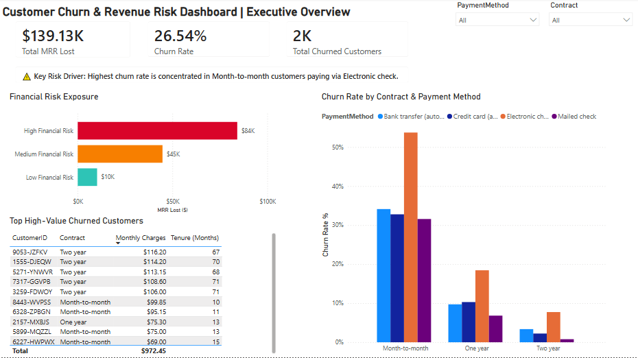
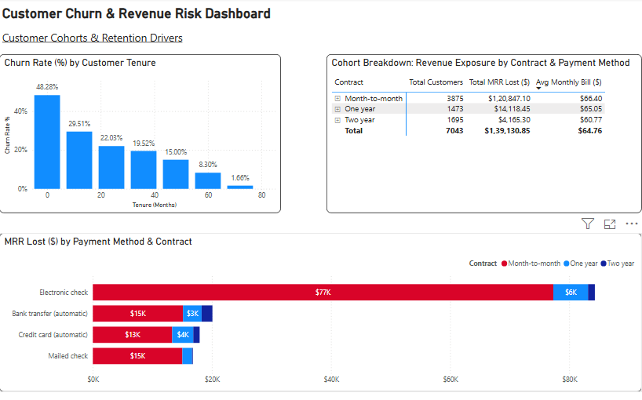

# 📊 Enterprise Customer Churn & Revenue Exposure Analytics

An end-to-end data analytics project using **Google BigQuery (SQL)** and **Power BI** to quantify Monthly Recurring Revenue (MRR) exposure, evaluate churn drivers across customer cohorts, and enable targeted retention strategies.

---

## 📸 Dashboard Preview

### Page 1: Executive Overview
*High-level business KPIs, risk classification, and top-value account exposure.*


---

### Page 2: Customer Cohorts & Retention Drivers
*Deep-dive analysis into tenure drop-offs, payment friction, and contract cohorts.*


---

## 📌 Business Case & Executive Summary

### The Problem
Most churn reports treat all churned users equally. However, losing a high-tier customer paying $110/month impacts bottom-line revenue significantly more than losing five entry-level accounts paying $20/month. 

This project shifts the focus from **headcount churn** to **revenue risk**, isolating the specific friction points that cost the business its highest-value MRR.

### Core Key Findings
* **Total Revenue Exposure:** **$139.13K MRR Lost** across **2,000 churned accounts** (26.54% overall churn rate).
* **Concentrated Risk:** **60.4% of lost revenue** originated from accounts categorized as **High Financial Risk**.
* **Primary Leakage Driver:** Month-to-Month customers paying via **Electronic Check** exhibited churn rates exceeding **50%**, representing over **$77K** in lost monthly recurring revenue alone.

---

## 🛠️ Technical Workflow & Architecture

### 1. Data Pipeline & Modeling (Google BigQuery)
Raw telemetry and billing records were queried in BigQuery using SQL CTEs, conditional risk logic, and multi-metric aggregations to construct analysis-ready metrics:
* Modeled a dynamic **Financial Risk Classification** based on monthly billing amounts and customer tenure bands.
* Aggregated churn rates, lost MRR, and projected annualized revenue impacts.

> 📄 **Full Query Pipeline:** View the complete transformation script in [`queries.sql`](queries.sql).

```sql
-- Core Logic Snippet: Financial Risk & Revenue Impact Aggregations
WITH Customer_Risk_Profile AS (
  SELECT 
    customerID,
    tenure,
    Contract,
    PaymentMethod,
    MonthlyCharges,
    Churn,
    CASE 
      WHEN MonthlyCharges >= 80 AND tenure <= 12 THEN 'High Financial Risk'
      WHEN MonthlyCharges >= 50 AND tenure <= 24 THEN 'Medium Financial Risk'
      ELSE 'Low Financial Risk'
    END AS risk_category
  FROM `protean-mind-466016-s3.customer_analytics.telco_churn`
)

SELECT 
  risk_category,
  COUNT(customerID) AS total_customers,
  SUM(CASE WHEN Churn IS TRUE THEN 1 ELSE 0 END) AS churned_customers,
  ROUND(SUM(CASE WHEN Churn IS TRUE THEN 1 ELSE 0 END) * 100.0 / COUNT(customerID), 2) AS churn_rate_pct,
  ROUND(SUM(CASE WHEN Churn IS TRUE THEN MonthlyCharges ELSE 0 END), 2) AS monthly_mrr_lost,
  ROUND(SUM(CASE WHEN Churn IS TRUE THEN MonthlyCharges ELSE 0 END) * 12, 2) AS annualized_revenue_impact
FROM Customer_Risk_Profile
GROUP BY risk_category
ORDER BY monthly_mrr_lost DESC;


```
### 2. Interactive Visualization (Power BI)
* **Star Schema Design:** Linked optimized BigQuery analytical outputs into a clean Power BI data model.
* **UX & Hierarchy:** Designed a two-page executive suite moving from macro revenue metrics (*Page 1*) to cohort-level retention breakdowns (*Page 2*).
* **DAX & Formatting:** Built custom measures for dynamic churn percentages, formatted monetary KPIs, and configured focus modes for granular review.

---

## 💡 Strategic Recommendations

1. **High-Value Month-to-Month Retention Campaign:**
   Target month-to-month accounts paying >$80/month with limited-time contract upgrade incentives (e.g., 10% discount for transitioning to a 1-year contract).
2. **AutoPay Migration Drive:**
   Since Electronic Check users drive over half of all MRR loss, introduce automated billing prompts and small one-time invoice credits for switching to automated bank transfers.

---

## 📁 Repository Structure

```text
├── images/
│   ├── executiveoverview.png
│   └── retentiondrivers.png
├── Telco_Customer_Churn.csv
├── BigQuery_PowerBI_Customer_Retention_Analyticsedit.pbix
├── queries.sql
├── LICENSE
└── README.md
```

## 🚀 Tech Stack Used

* **Database & Querying:** Google BigQuery (SQL, CTEs, Aggregations, Data Profiling)
* **Business Intelligence:** Power BI Desktop (DAX(basics), Data Modeling, UX Design)
* **Version Control:** Git & GitHub

---

*Thank you for taking the time to review this project. Feedback is always welcome!*
